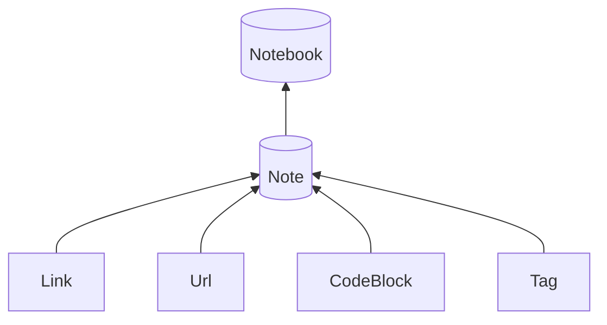

# Pretty-Notebook

A Python toolkit and FastAPI publisher for interconnected Markdown notebooks.

[Documentation](https://github.com/outside-labs/Pretty-Notebook/blob/main/docs/pnbp.md)

```mermaid
graph BT
	id1[(Notebook)]
	id2[(Note)] --> id1
	Link --> id2
	Url --> id2
	CodeBlock --> id2
	Tag --> id2
```

