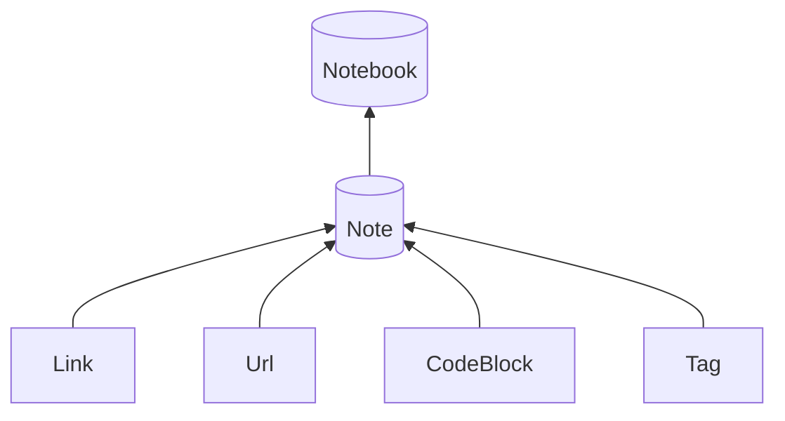

# Pretty-Notebook

A Python toolkit for interconnected Markdown notebooks. The repository also
contains a FastAPI publisher with a constrained public-deployment profile.

The `0.10.0` release supports the `pretty_notebook` Python package and its `pnbp`
command-line interface on Python 3.11 or newer:

```bash
python -m pip install --upgrade pip
python -m pip install pretty-notebook==0.10.0
```

The repository supports the `apps/web` publisher as one Gunicorn instance with up to four workers,
one local SQLite database and one owning notebook behind a TLS reverse proxy. Read the
deployment contract and security boundaries before exposing it publicly. The
macOS URL handlers remain unsupported.

[Documentation index](docs/index.md) · [Workflow tutorial](docs/tutorials.md) · [0.10.0 release notes](docs/release-0.10.0.md) · [Web deployment](docs/web.md) · [Development roadmap](docs/roadmap.md)

The current release is `pretty-notebook==0.10.0`. It includes settings/profiles,
identities, checked publication, search/navigation, reference-style appearance
preferences and coordinated worker deployments. Upgrade an old installation:

```sh
python -m pip uninstall pnbp
python -m pip install pretty-notebook==0.10.0
```

The final `pnbp==0.10.0` distribution installs the canonical package and contains
no implementation modules. [0.10 release notes](docs/release-0.10.0.md) and
[versions/support](docs/versions.md) define the supported scope. Tagged GitHub
documentation is the release reference; hosted documentation remains separate.

New code uses `from pretty_notebook import Notebook, Note`; existing `pnbp`
imports and the `pnbp` executable remain compatible. See the
[package migration](docs/package-migration.md) before upgrading old installations.



<p align=center>
  
</p>
