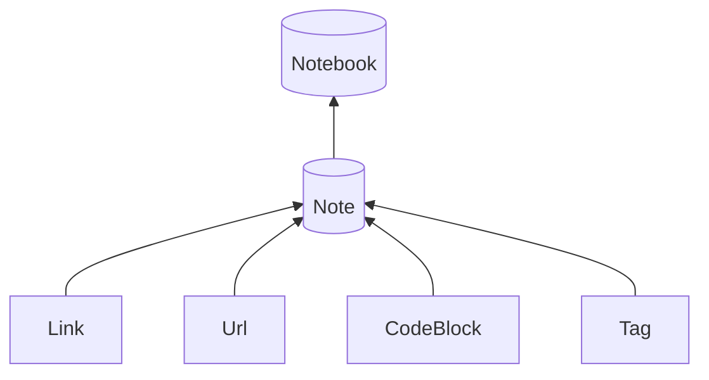

# Pretty-Notebook

A Python toolkit for interconnected Markdown notebooks. The repository also
contains an experimental FastAPI publisher.

The published `0.9.0rc1` release supports the `pnbp` Python package and its
`pnbp` command-line interface on Python 3.11 or newer. Install the candidate
explicitly with `python -m pip install pnbp==0.9.0rc1`.
The repository's `apps/web` publisher is experimental and is not supported for
public deployment in 0.9. The macOS URL handlers are also unsupported.

[Package documentation](docs/pnbp.md) · [0.9.0rc1 release notes](docs/release-0.9.0rc1.md) · [Experimental web app](docs/web.md)

  

