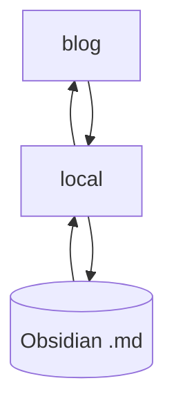

blog/
a FastAPI implementation of publishing static websites (aka blog) from https://obsidian.md/.


--- 

blog/

- receives via API to put/post/delete HTML (& images) of set #public notes, wraps 'em with jinja2 extends template tags, and saves each "page" statically to templates/blog/.html file to be rendered quick and statically. (via local/)
- Tl;dr the most essential things happening are that notebook/[[My Next Best Note]] -> myblogurl.com/my-next-best-note is caught via existence as a single slug through a single general {content} view function. 

--- 
**installing blog/**

```sh
cd blog/
pip install -r requirements.txt
touch .env
```

need to add .env file values via any text editor:
(pick a non-default JWT_ALGO if desired)

```py
JWT_SECRET=long123random456alphanumeric
JWT_ALGO=HS256
```
generate long alphanumeric JWS_SECRET via e.g. 

```py
>>> import uuid
>>> uuid.uuid4().hex
'1ab12802724b4d9ebe92e3eecae8b4f6'
```

--> 

```
python main.py
\# then in browser see: https://127.0.0.1:8000/ 
```

--- 
Place a version of **blog-settings.json** locally into your nb.NOTE_PATH
e.g.

```json
{
    "NAV_BRAND": "<i class='bi bi-globe2'></i><i class='bi bi-book-fill'></i> ",
    "NAV_PAGES": {
        "content": "/index/",
        "about": "/obsidian-parser/",
        "contact": [
            {
                "github": "https://github.com/pysidian"
            },
            {
                "subname2": "/subroute2/"
            }
        ]
    },
    "FOOTER": "<p><small>mail to:</small><button type=\"button\" class=\"btn btn-link\"><small>self&commat;linked.page</small></button> &nbsp;| <small>powered by <a href=\"https://www.python.org/\">Python</a>&nbsp;,&nbsp;<a href=\"https://fastapi.tiangolo.com/\">FastAPI</a>&nbsp;,&nbsp;<a href=\"https://getbootstrap.com/\">Bootstrap</a>&nbsp;,&nbsp;and&nbsp;</a><a href=\"https://obsidian.md/\">Obsidian</a>&nbsp;via&nbsp;<a href=\"https://daringfireball.net/projects/markdown/\">markdown</a>.</small></p>",
    "darkmode": false,
    "hljs_light": "default",
    "hljs_dark": "xt256",
    "merm_light": "default",
    "merm_dark": "dark"
}
```

--- 

further initialization 

```sh
% cd ../local
% python3
```

```py
>>> from models import PysidianNotebook
>>> nb = PysidianNotebook()
>>> nb.create_api_user()
>>> nb.refresh_token()
>>> # username: 
>>> # password: 
>>> # --> can test commit with
>>> nb.get_authed_user()
>>> # --> commit your new settings ! 
>>> nb.blog_settings_post()
>>> # --> tag a note #public
>>> # --> 
>>> nb.post_commits_to_blog_api()
>>> # ^^ equiv to local/ avail commands
>>> # % commit-remote-api
>>> # or 
>>> # % commit-local-api
```

...

```py
>>> nb.reset_api_password()
>>> nb.refresh_token() # even while same password, now old token rejected
```

--- 
